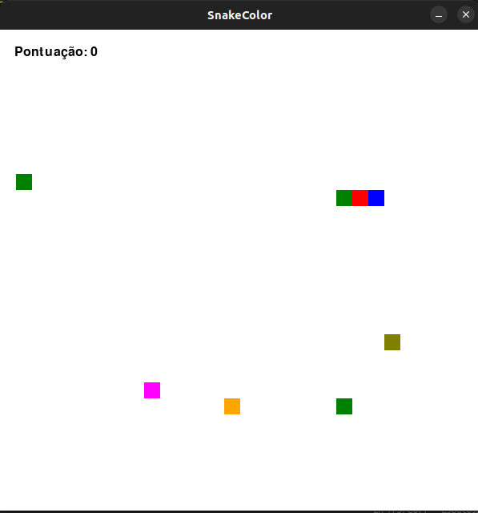

# SnakeColor
Jogo desenvolvido a fim de consolidar o aprendizado de filas.
  

  

## Descrição do projeto
Este projeto foi desenvolvido utilizando a biblioteca python Pygame.
Se passe de uma adaptação colorida do jogo Snake utilizando o conceito de filas.

## Como rodar o jogo

1. Para rodar o jogo, você irá precisar ter o python instlado na máquina e seu gerenciador de pacotes "pip".

2. Depois de instalado, navegue até o diretório onde se encontra o jogo e utilize o comando "pip install pygame".

3. Rode o código.

## Funcionamento
    Snake ao comer bloco:

        -De cor diferente:
            Bloco é adicionado ao final da cobra e a velocidade aumentada.
            pontuacao: +1

        -De cor igual:
            Bloco é removido do inicio da cobra(cabeça) e a velocidade aumentada.
            pontuação: -1
